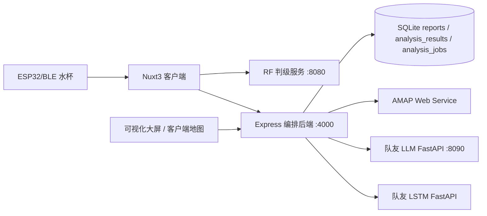

# Part 3 大数据分析平台 · 编排 API 文档

> 适用范围：`part3-analytics-platform` Express + SQLite 后端  
> Base URL：`http://localhost:4000/api/v1`  
> 职责边界：我方负责 **AMAP、数据存储、地图聚合、LLM/LSTM 服务编排与缓存**；队友服务负责 **LLM 报告生成** 与 **LSTM 时序分析模型**。

## 1. Features

- 接收客户端提交的水质检测报告，保存 20 条稳定原始样本与众数评级结果。
- 为 AMAP 大屏提供点位、区域聚合、仪表盘摘要和历史趋势 API。
- 从 SQLite 聚合区域/点位快照，主动调用队友 LLM 服务生成 Markdown 情况描述与 NGO 改善提案。
- 将队友同步 LSTM REST 接口包装为我方异步任务，便于前端轮询任务状态。
- 提供统一响应封套、错误码和健康检查，降低三端联调成本。

## 2. System Architecture



### 2.1 服务分工

| 模块 | 负责人 | 职责 |
|---|---|---|
| Express 编排后端 | 我方 | 存储报告、聚合快照、AMAP 代理、任务状态、统一封套 |
| SQLite | 我方 | 保存检测记录、LLM 结果缓存、LSTM 编排任务 |
| AMAP | 我方 | 逆地理编码、地图点位展示、区域聚合展示 |
| LLM FastAPI | 队友 | 根据我方传入的快照同步生成 Markdown 情况描述/报告 |
| LSTM FastAPI | 队友 | 接收时序读数、异常检测、趋势预测、区域分析，同步返回结果 |

## 3. Common Conventions

### 3.1 Response Envelope

所有我方 API 返回统一封套：

```json
{
  "code": 0,
  "message": "ok",
  "data": {}
}
```

错误示例：

```json
{
  "code": 3001,
  "message": "teammate service failed",
  "data": {
    "service": "llm",
    "detail": "connect ECONNREFUSED"
  }
}
```

### 3.2 Error Codes

| Code | Meaning | Typical Scenario |
|---:|---|---|
| `0` | 成功 | 请求正常完成 |
| `1001` | 参数错误 | 缺少必填字段、类型错误、枚举错误 |
| `1002` | 外部 API Key 缺失 | AMAP Key 未配置 |
| `1003` | 资源不存在 | report_id / job_id 不存在 |
| `1004` | 业务校验失败 | 未确认真实性、样本不足 20 条 |
| `2001` | 内部错误 | SQLite 或未知服务端错误 |
| `3001` | 队友服务调用失败 | LLM/LSTM 返回非 2xx 或封套异常 |
| `3002` | 队友服务超时 | LLM/LSTM 请求超过超时配置 |
| `3003` | 任务冲突 | 同一 scope 正在运行中的异步任务 |

### 3.3 Time, Coordinates, Region

| Item | Convention |
|---|---|
| 时间 | ISO 8601 字符串，建议带 `+08:00` |
| 坐标 | GCJ-02，经纬度字段为 `lng` / `lat` |
| 演示城市 | 默认 `beijing` |
| 区域字段 | `district` 用于区级聚合，`city` 用于城市筛选 |

## 4. Data Models

### 4.1 `reports`

| Column | Type | Required | Description |
|---|---|---:|---|
| `id` | INTEGER | Yes | 自增主键 |
| `report_id` | TEXT | Yes | 对外报告 ID，唯一 |
| `device_id` | TEXT | Yes | 水杯设备 ID |
| `lat` | REAL | Yes | 纬度 |
| `lng` | REAL | Yes | 经度 |
| `city` | TEXT | No | 城市，默认 `beijing` |
| `district` | TEXT | No | 区县 |
| `address` | TEXT | No | 详细地址 |
| `water_type` | TEXT | Yes | `tap`/`river`/`lake`/`well`/`purified`/`mineral`/`boiled`/`other` |
| `tds` | REAL | No | TDS ppm，仅展示，不参与 RF 判级 |
| `ph` | REAL | Yes | pH |
| `temperature` | REAL | Yes | 温度 ℃ |
| `turbidity` | REAL | Yes | 浊度 NTU |
| `ec` | REAL | Yes | 电导率 μS/cm |
| `grade` | TEXT | Yes | Ⅰ类、Ⅱ类、Ⅲ类、Ⅳ类、Ⅴ类、劣Ⅵ类 |
| `grade_index` | INTEGER | Yes | 0-5，数值越大风险越高 |
| `authenticity_confirmed` | INTEGER | Yes | 用户确认真实水体数据后为 1 |
| `user_note` | TEXT | No | 用户附加文本 |
| `raw_samples_json` | TEXT | Yes | 20 条稳定原始传感器读数 |
| `capture_json` | TEXT | No | 采样过程诊断，如离散点数量、稳定性 |
| `is_seed` | INTEGER | Yes | 真实数据 0，演示种子 1 |
| `measured_at` | TEXT | Yes | 检测时间 |
| `created_at` | TEXT | Yes | 入库时间 |

### 4.2 `analysis_results`

| Column | Type | Required | Description |
|---|---|---:|---|
| `id` | INTEGER | Yes | 自增主键 |
| `scope` | TEXT | Yes | `region` 或 `point` |
| `region` | TEXT | No | 区域分析目标 |
| `ref_report_id` | TEXT | No | 点位分析关联报告 ID |
| `model` | TEXT | No | 队友 LLM 返回/配置的模型名 |
| `input_snapshot` | TEXT | Yes | 我方传给 LLM 的聚合快照 JSON |
| `content` | TEXT | Yes | Markdown 报告正文 |
| `created_at` | TEXT | Yes | 生成时间 |

### 4.3 `analysis_jobs`

| Column | Type | Required | Description |
|---|---|---:|---|
| `id` | INTEGER | Yes | 自增主键 |
| `job_id` | TEXT | Yes | 对外任务 ID，唯一 |
| `job_type` | TEXT | Yes | 目前为 `lstm_forecast` |
| `scope_type` | TEXT | Yes | `district`/`city`/`custom` |
| `scope_id` | TEXT | No | 区域 ID，如 `海淀区` |
| `status` | TEXT | Yes | `pending`/`running`/`succeeded`/`failed`/`expired` |
| `progress` | INTEGER | Yes | 0-100 |
| `request_json` | TEXT | Yes | 前端请求参数 |
| `result_json` | TEXT | No | 队友 LSTM 同步结果 |
| `error_message` | TEXT | No | 失败原因 |
| `external_task_id` | TEXT | No | 保留字段，队友若升级异步接口可映射 |
| `created_at` | TEXT | Yes | 创建时间 |
| `started_at` | TEXT | No | 开始时间 |
| `finished_at` | TEXT | No | 完成时间 |

## 5. API Reference

## 5.1 Health

### `GET /health`

检查我方 Express、SQLite、队友 LLM/LSTM、AMAP 配置状态。

**Parameters:** none

**Returns:**

```json
{
  "code": 0,
  "message": "ok",
  "data": {
    "service": "sdg6-analytics-platform",
    "status": "up",
    "db": "ok",
    "teammates": {
      "llm": { "status": "up" },
      "lstm": { "status": "up" }
    },
    "amap": { "configured": true },
    "time": "2026-07-23T12:00:00.000+08:00"
  }
}
```

**Throws:** `2001`

---

## 5.2 Reports

### `POST /reports`

创建检测报告。客户端应先完成“开始记录 → 稳定检测 → 去离散 → 收满 20 条稳定样本 → 输入备注 → 确认真实 → 选择水体类型”的流程。

**Request Body:**

| Parameter | Type | Required | Default | Description |
|---|---|---:|---|---|
| `device_id` | `string` | Yes | — | 水杯设备 ID |
| `location.lat` | `number` | Yes | — | 纬度 |
| `location.lng` | `number` | Yes | — | 经度 |
| `location.city` | `string` | No | `beijing` | 城市 |
| `location.district` | `string` | No | — | 区县 |
| `location.address` | `string` | No | — | 地址 |
| `water_type` | `string` | Yes | — | 水体类型枚举 |
| `metrics` | `object` | Yes | — | 20 条样本的聚合指标 |
| `grade` | `string` | Yes | — | 20 条样本评级的众数 |
| `grade_index` | `number` | Yes | — | 0-5 |
| `authenticity_confirmed` | `boolean` | Yes | — | 必须为 `true` 才作为真实点入库 |
| `user_note` | `string` | No | — | 附加文本 |
| `raw_samples` | `array` | Yes | — | 去除离散/不稳定状态后的 20 条原始样本 |
| `capture` | `object` | No | — | 稳定性诊断信息 |
| `measured_at` | `string` | No | 当前时间 | ISO 8601 |

**Returns:** `Report`

**Throws:**

- `1001` — 参数格式错误
- `1004` — 未确认真实数据或稳定样本不足 20 条

**Example:**

```bash
curl -X POST http://localhost:4000/api/v1/reports \
  -H 'Content-Type: application/json' \
  -d '{
    "device_id":"cup-001",
    "location":{"lat":39.9042,"lng":116.4074,"city":"beijing","district":"东城区"},
    "water_type":"tap",
    "metrics":{"temperature":24.6,"ph":7.2,"ec":430,"turbidity":1.8,"tds":220},
    "grade":"Ⅱ类",
    "grade_index":1,
    "authenticity_confirmed":true,
    "raw_samples":[{"temperature":24.5,"ph":7.2,"ec":431,"turbidity":1.7,"tds":219}],
    "capture":{"stable_count":20,"discarded_count":3},
    "user_note":"学校饮水机旁自来水"
  }'
```

> 实现校验：MVP 允许样例中省略到少于 20 条用于调试时可通过 `ALLOW_SHORT_SAMPLES=true` 放开；正式演示应关闭。

### `GET /reports/{report_id}`

获取报告详情。

**Parameters:**

| Parameter | Type | Required | Default | Description |
|---|---|---:|---|---|
| `report_id` | `string` | Yes | — | 报告 ID |

**Returns:** `Report`

**Throws:** `1003`

---

## 5.3 AMAP / Map APIs

### `GET /map/points`

返回地图散点。

**Query Parameters:**

| Parameter | Type | Required | Default | Description |
|---|---|---:|---|---|
| `city` | `string` | No | — | 城市筛选 |
| `district` | `string` | No | — | 区县筛选 |
| `water_type` | `string` | No | — | 水体类型 |
| `grade_max` | `number` | No | — | 只返回 `grade_index <= grade_max` |
| `real_only` | `boolean` | No | `false` | 只看真实点 |
| `from` | `string` | No | — | 起始时间 |
| `to` | `string` | No | — | 结束时间 |
| `limit` | `number` | No | `500` | 最大 1000 |

**Returns:**

```json
[
  {
    "report_id": "rpt_xxx",
    "lat": 39.9042,
    "lng": 116.4074,
    "city": "beijing",
    "district": "东城区",
    "water_type": "tap",
    "grade": "Ⅱ类",
    "grade_index": 1,
    "is_seed": false,
    "measured_at": "2026-07-23T12:00:00.000+08:00"
  }
]
```

### `GET /map/districts`

返回行政区聚合，用于 AMAP 区域着色。

**Query Parameters:**

| Parameter | Type | Required | Default | Description |
|---|---|---:|---|---|
| `city` | `string` | No | `beijing` | 城市 |
| `real_only` | `boolean` | No | `false` | 只统计真实点 |
| `from` | `string` | No | — | 起始时间 |
| `to` | `string` | No | — | 结束时间 |

**Risk Score:**

```text
risk_score = avg_grade_index / 5 * 70 + bad_ratio * 20 + recent_bad_bonus * 10
bad_ratio = grade_index >= 3 的比例
recent_bad_bonus = 最近 7 天有 grade_index >= 4 则为 1，否则 0
```

### `GET /geo/reverse?lat=&lng=`

AMAP 逆地理编码代理。

**Query Parameters:**

| Parameter | Type | Required | Default | Description |
|---|---|---:|---|---|
| `lat` | `number` | Yes | — | 纬度 |
| `lng` | `number` | Yes | — | 经度 |

**Returns:**

```json
{
  "city": "北京市",
  "district": "海淀区",
  "address": "北京市海淀区...",
  "formatted_address": "北京市海淀区..."
}
```

**Throws:** `1002`, `3001`, `3002`

---

## 5.4 Dashboard

### `GET /dashboard/summary`

大屏顶部指标。

**Query Parameters:**

| Parameter | Type | Required | Default | Description |
|---|---|---:|---|---|
| `city` | `string` | No | — | 城市 |
| `real_only` | `boolean` | No | `false` | 只统计真实点 |

**Returns:**

```json
{
  "total": 128,
  "real_total": 8,
  "district_count": 9,
  "avg_grade_index": 2.14,
  "pass_rate": 0.72,
  "bad_count": 19
}
```

### `GET /dashboard/trend`

水质趋势。

**Query Parameters:**

| Parameter | Type | Required | Default | Description |
|---|---|---:|---|---|
| `days` | `number` | No | `30` | 最近天数，1-365 |
| `bucket` | `string` | No | `day` | `day`/`week` |
| `city` | `string` | No | — | 城市 |
| `district` | `string` | No | — | 区县 |
| `real_only` | `boolean` | No | `false` | 只统计真实点 |

---

## 5.5 LLM Insights Orchestration

### `POST /insights/generate`

我方从 SQLite 聚合快照，调用队友 LLM 服务同步生成 Markdown，并缓存到 `analysis_results`。前端可把它当成“慢请求”；如需真正后台化，可在 UI 层显示 loading。

**Request Body:**

| Parameter | Type | Required | Default | Description |
|---|---|---:|---|---|
| `scope` | `string` | Yes | — | `region` 或 `point` |
| `region` | `string` | Conditional | — | scope=region 时必填 |
| `ref_report_id` | `string` | Conditional | — | scope=point 时必填 |
| `no_cache` | `boolean` | No | `false` | 忽略我方缓存重新生成 |

**Teammate Request:** `POST {LLM_SERVICE_URL}/api/v1/insights/generate`

```json
{
  "scope": "region",
  "region": "海淀区",
  "ref_report_id": null,
  "snapshot": {
    "summary": {},
    "districts": [],
    "points": []
  }
}
```

**Returns:**

```json
{
  "scope": "region",
  "region": "海淀区",
  "ref_report_id": null,
  "cached": false,
  "model": "gpt-5.5",
  "content": "# 海淀区水质情况描述\n...",
  "created_at": "2026-07-23T12:00:00.000+08:00"
}
```

**Throws:** `1001`, `1003`, `3001`, `3002`

### `GET /insights/records`

查询我方已缓存的 LLM 生成记录。

**Query Parameters:**

| Parameter | Type | Required | Default | Description |
|---|---|---:|---|---|
| `scope` | `string` | No | — | `region`/`point` |
| `region` | `string` | No | — | 区域 |
| `ref_report_id` | `string` | No | — | 报告 ID |
| `limit` | `number` | No | `20` | 最大 100 |

---

## 5.6 LSTM Async Job Orchestration

队友 LSTM 当前是同步 REST，不提供异步任务轮询。因此我方提供异步 job 包装：

1. 前端 `POST /analysis/lstm/jobs` 创建任务。
2. 我方立即写入 `analysis_jobs(status=pending)` 并返回 `job_id`。
3. Express 后台异步调用队友 LSTM：
   - 区域分析：`POST {LSTM_SERVICE_URL}/api/v1/lstm/analysis/generate`
   - 单条/实时读数异常检测：`POST {LSTM_SERVICE_URL}/api/v1/lstm/readings`
4. 调用成功则写 `succeeded + result_json`；失败写 `failed + error_message`。
5. 前端轮询 `GET /analysis/lstm/jobs/{job_id}`。

### `POST /analysis/lstm/jobs`

创建 LSTM 分析任务。

**Request Body:**

| Parameter | Type | Required | Default | Description |
|---|---|---:|---|---|
| `scope_type` | `string` | Yes | — | `district`/`city`/`custom` |
| `scope_id` | `string` | No | — | 区域名，如 `海淀区` |
| `limit` | `number` | No | `300` | 传给队友服务的聚合数量，20-5000 |
| `no_cache` | `boolean` | No | `false` | 传给队友服务 |

**Returns:**

```json
{
  "job_id": "job_xxx",
  "status": "pending",
  "progress": 0,
  "poll_url": "/api/v1/analysis/lstm/jobs/job_xxx"
}
```

**Throws:** `1001`, `3003`

### `GET /analysis/lstm/jobs/{job_id}`

查询任务状态。

**Returns:**

```json
{
  "job_id": "job_xxx",
  "status": "succeeded",
  "progress": 100,
  "result": {
    "analysis": "..."
  },
  "error_message": null,
  "created_at": "2026-07-23T12:00:00.000+08:00",
  "finished_at": "2026-07-23T12:00:08.000+08:00"
}
```

---

## 6. Teammate Service Contracts

### 6.1 LLM Service

| Item | Value |
|---|---|
| Base URL | `LLM_SERVICE_URL`, default `http://localhost:8090` |
| Health | `GET /health` |
| Generate | `POST /api/v1/insights/generate` |
| Response | 裸对象或队友自定义对象，我方会兼容提取 `content`/`markdown`/`report` |
| Timeout | `LLM_TIMEOUT_MS`, default `60000` |

### 6.2 LSTM Service

| Item | Value |
|---|---|
| Base URL | `LSTM_SERVICE_URL`, default `http://localhost:8091` |
| Health | `GET /health` |
| Ingest Reading | `POST /api/v1/lstm/readings` |
| Region Analysis | `POST /api/v1/lstm/analysis/generate` |
| Status | `GET /api/v1/lstm/status` |
| Response | `{ code, message, data }` |
| Timeout | `LSTM_TIMEOUT_MS`, default `30000` |

## 7. Configuration

| Env | Required | Default | Description |
|---|---:|---|---|
| `PORT` | No | `4000` | Express 端口 |
| `DB_PATH` | No | `./data/analytics.sqlite` | SQLite 文件 |
| `AMAP_KEY` | P1 | — | 高德 Web Service Key |
| `LLM_SERVICE_URL` | No | `http://localhost:8090` | 队友 LLM 服务 |
| `LLM_TIMEOUT_MS` | No | `60000` | LLM 超时 |
| `LSTM_SERVICE_URL` | No | `http://localhost:8091` | 队友 LSTM 服务 |
| `LSTM_TIMEOUT_MS` | No | `30000` | LSTM 超时 |
| `DEFAULT_CITY` | No | `beijing` | 默认城市 |
| `ALLOW_SHORT_SAMPLES` | No | `false` | 调试时允许 raw_samples 少于 20 |

## 8. MVP Priority

| Priority | Endpoint |
|---|---|
| P0 | `POST /reports` |
| P0 | `GET /reports/{report_id}` |
| P0 | `GET /map/points` |
| P0 | `GET /map/districts` |
| P0 | `GET /dashboard/summary` |
| P0 | `POST /insights/generate` |
| P0 | `GET /health` |
| P1 | `GET /insights/records` |
| P1 | `POST /analysis/lstm/jobs` |
| P1 | `GET /analysis/lstm/jobs/{job_id}` |
| P1 | `GET /geo/reverse` |
| P2 | `WS /ws/live` |

## 9. Frontend Integration Notes

- 客户端“提交报告”按钮应改名为“开始记录”。
- 采集满 20 条稳定样本后才进入备注、真实性确认、水体类型选择和上传。
- 上传成功后前端可立即刷新 `/map/points?real_only=true`，展示 LIVE 点位。
- LLM 慢生成时，前端调用 `/insights/generate` 后显示“正在生成区域提案”。
- LSTM 走 job：创建任务后每 1-2 秒轮询一次状态，直到 `succeeded` 或 `failed`。
