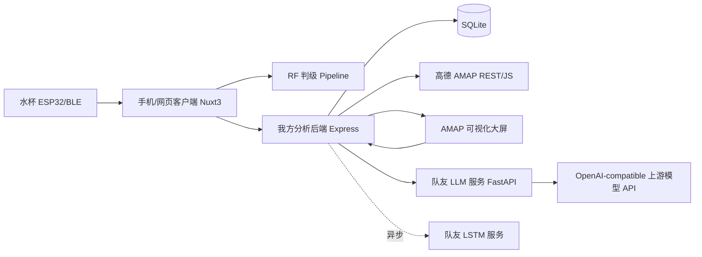
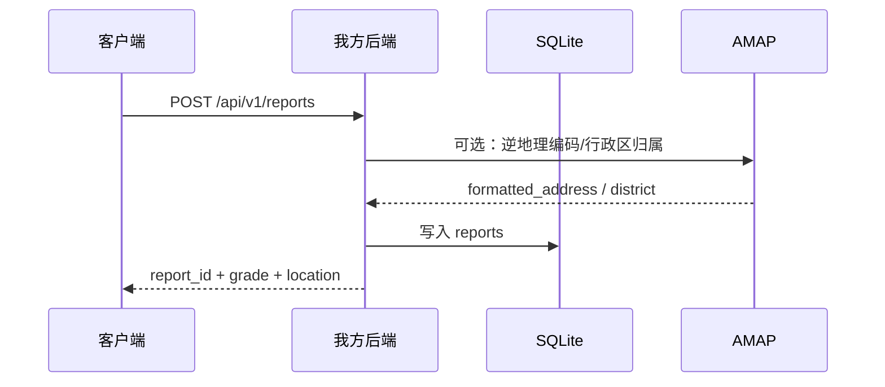
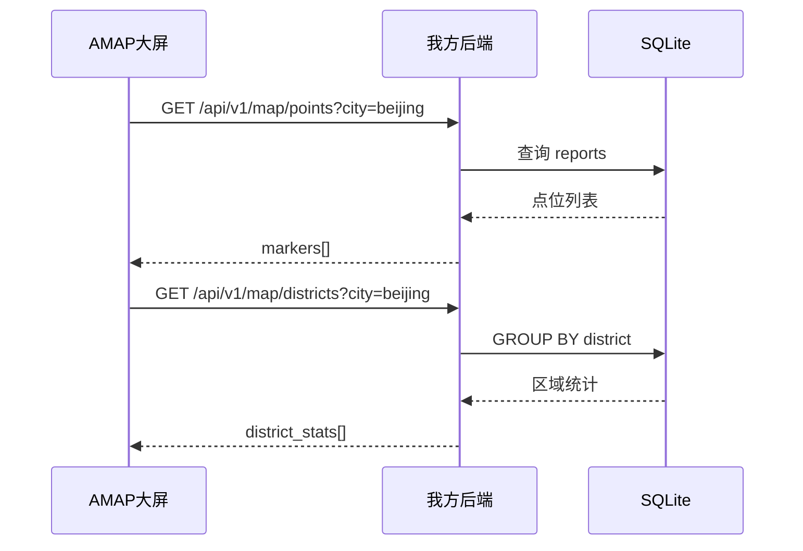
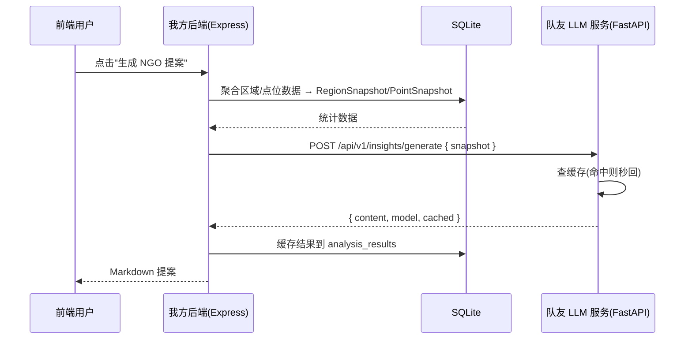

# Part 3 大数据分析平台 · API 文档

> 状态：设计阶段，不写代码  
> 本版重点：**AMAP 地图展示由我方负责**；**LLM 情况描述/报告** 与 **LSTM 时序分析** 由队友的独立分析服务负责。  
> 数据库：SQLite。演示中心城市：北京。  
> 目标：Express 后端聚合数据 → 同步调用队友 LLM 服务（`Services/LLM/app.py`）→ 返回 Markdown 提案；LSTM 保持异步轮询。

---

## 1. 本部分重新定位

第三部分不再是一个单体"大数据后端"包打天下，而拆成三个职责边界清晰的模块：

| 模块 | 负责人 | 主要职责 | 是否同步返回 |
|---|---|---|---|
| AMAP 地图与地点信息 | 我方 | 北京地图点位、区域聚合、报告详情弹窗、逆地理编码、前端交互入口 | 大多数同步 |
| LLM 分析服务 | 队友服务端（已实现 `Services/LLM/app.py`） | 根据区域/点位快照生成 NGO 改善提案 Markdown | **同步**（约10-30秒），内置缓存秒回 |
| LSTM 时序服务 | 队友服务端 | 根据历史水质序列预测趋势、异常波动、水质变化风险 | 异步 |

我方后端的定位是：

1. 保存真实检测报告和模拟背景数据到 SQLite。
2. 给 AMAP 大屏提供地图点位、区域统计、详情查询 API。
3. Express 后端聚合区域/点位数据 → 组装 `RegionSnapshot`/`PointSnapshot` → 调用队友 LLM 服务。
4. 缓存分析结果，供大屏快速重复展示。
5. 对 LSTM 部分保留异步任务机制。

---

## 2. 总体架构



### 2.1 数据流一：提交水质报告



### 2.2 数据流二：地图展示



### 2.3 数据流三：LLM 提案生成（同步快照模式）



> **设计决策**：LLM 服务采用**同步快照模式**而非之前设计的异步任务模式。原因是：
> 1. LLM 服务 (`Services/LLM/app.py`) 已内置 SQLite 缓存，重复请求直接返回 `cached=true`。
> 2. 快照数据（区域聚合指标）由 Express 后端提前聚合并随请求传入，LLM 服务不访问业务 DB，职责纯粹。
> 3. Hackathon 场景下 `gpt-5.5` 生成 400–600 字提案约 10–30 秒，同步模式足够。
> 4. 前端用 loading 动效等待即可，无需轮询任务状态。

---

## 3. 全局 API 约定

### 3.1 Base URL

开发期：

```text
http://localhost:4000/api/v1
```

局域网/演示期：

```text
http://<server-ip>:4000/api/v1
```

队友 LLM 服务 Base URL：

```text
http://<teammate-server>:8090
```

### 3.2 响应格式

所有我方 API 统一返回：

```json
{
  "code": 0,
  "message": "ok",
  "data": {}
}
```

错误示例：

```json
{
  "code": 1001,
  "message": "missing report_id",
  "data": null
}
```

### 3.3 错误码

| code | HTTP | 含义 |
|---:|---:|---|
| 0 | 200 | 成功 |
| 1001 | 400 | 参数错误 |
| 1002 | 401 | API Key 错误 |
| 1003 | 404 | 资源不存在 |
| 1004 | 422 | 数据校验失败 |
| 2001 | 500 | 我方服务内部错误 |
| 3001 | 502 | 队友 LLM/LSTM 服务调用失败 |
| 3002 | 504 | 队友服务超时 |
| 3003 | 409 | 分析任务状态冲突，例如重复提交 |

### 3.4 时间与坐标

| 项 | 约定 |
|---|---|
| 时间 | ISO 8601，例如 `2026-07-23T10:30:00+08:00` |
| 城市 | MVP 固定 `beijing` |
| 地图坐标 | 前端 AMAP 使用 GCJ-02 坐标 |
| 数据库存储 | MVP 直接存 GCJ-02，避免前端显示偏移 |
| 默认地图中心 | 北京：`lng=116.4074`, `lat=39.9042` |

> 注意：如果水杯/浏览器定位拿到的是 WGS84，需要在入库前或前端展示前转换为 GCJ-02，否则高德地图点位会偏移。MVP 可统一规定客户端提交给后端的 `lat/lng` 已经是 GCJ-02。

---

## 4. SQLite 数据模型

### 4.1 `reports` — 水质检测报告主表

保存客户端提交的一次完整检测记录。

| 字段 | 类型 | 必填 | 说明 |
|---|---|---:|---|
| `id` | INTEGER PK | 是 | 自增主键 |
| `report_id` | TEXT UNIQUE | 是 | 对外展示 ID，例如 `rep_20260723_xxxx` |
| `device_id` | TEXT | 是 | 水杯设备 ID |
| `lat` | REAL | 是 | 纬度，GCJ-02 |
| `lng` | REAL | 是 | 经度，GCJ-02 |
| `city` | TEXT | 是 | MVP 固定 `beijing` |
| `district` | TEXT | 否 | 北京行政区，如 `海淀区`、`朝阳区` |
| `address` | TEXT | 否 | AMAP 逆地理编码地址 |
| `water_type` | TEXT | 是 | `tap/river/lake/well/purified/mineral/boiled/other` |
| `tds` | REAL | 否 | ppm |
| `ph` | REAL | 否 | pH |
| `temperature` | REAL | 否 | ℃ |
| `turbidity` | REAL | 否 | NTU |
| `ec` | REAL | 否 | μS/cm |
| `grade` | TEXT | 是 | 国标等级，如 `Ⅰ类`、`劣Ⅵ类` |
| `grade_index` | INTEGER | 是 | 0-5，越大越差 |
| `authenticity_confirmed` | INTEGER | 是 | 1=true，0=false |
| `user_note` | TEXT | 否 | 用户备注 |
| `raw_samples_json` | TEXT | 否 | 20条原始采样 JSON 字符串 |
| `capture_json` | TEXT | 否 | 稳定性、众数评级等聚合信息 |
| `is_seed` | INTEGER | 是 | 1=模拟数据，0=真实检测 |
| `measured_at` | TEXT | 是 | 检测时间 |
| `created_at` | TEXT | 是 | 入库时间 |

### 4.2 `analysis_results` — LLM 提案缓存表

存储每次 LLM 生成的提案结果，同时充当缓存。

| 字段 | 类型 | 必填 | 说明 |
|---|---|---:|---|
| `id` | INTEGER PK | 是 | 自增主键 |
| `scope` | TEXT | 是 | `region` 或 `point` |
| `region` | TEXT | 否 | 区域名，如"海淀区" |
| `ref_report_id` | TEXT | 否 | scope=point 时关联的报告 ID |
| `model` | TEXT | 是 | 使用的 LLM 模型，如 `gpt-5.5` |
| `input_snapshot` | TEXT(JSON) | 是 | 发给 LLM 的快照数据（可复现） |
| `content` | TEXT | 是 | 生成的提案全文（Markdown） |
| `created_at` | TEXT | 是 | 生成时间 |

### 4.3 `analysis_jobs` — LSTM 异步分析任务表

仅用于 LSTM 时序分析任务。

| 字段 | 类型 | 必填 | 说明 |
|---|---|---:|---|
| `id` | INTEGER PK | 是 | 自增主键 |
| `job_id` | TEXT UNIQUE | 是 | 任务 ID，例如 `job_lstm_xxxx` |
| `job_type` | TEXT | 是 | `lstm_forecast` |
| `scope_type` | TEXT | 是 | `district/city/custom` |
| `scope_id` | TEXT | 否 | 行政区名或城市名 |
| `status` | TEXT | 是 | `pending/running/succeeded/failed/expired` |
| `progress` | INTEGER | 是 | 0-100 |
| `request_json` | TEXT | 是 | 发给队友服务的请求体 |
| `result_json` | TEXT | 否 | 队友服务返回的结果 |
| `error_message` | TEXT | 否 | 失败原因 |
| `external_task_id` | TEXT | 否 | 队友服务返回的 task_id |
| `created_at` | TEXT | 是 | 创建时间 |
| `started_at` | TEXT | 否 | 开始执行时间 |
| `finished_at` | TEXT | 否 | 完成时间 |

### 4.4 `district_cache` — 区域聚合缓存（可选）

MVP 可不建，直接 `GROUP BY` 查询 `reports`。如果地图刷新卡顿，再加缓存表。

---

## 5. 我方 API：报告与地图

## 5.1 创建水质报告

```http
POST /api/v1/reports
```

### 用途

客户端完成一次水杯采集后，把代表指标、原始样本、位置、水体类型、真实性确认上传到我方后端。

### Request

```json
{
  "device_id": "cup-001",
  "location": {
    "lat": 39.9842,
    "lng": 116.3074,
    "city": "beijing",
    "district": "海淀区",
    "address": "北京市海淀区中关村附近"
  },
  "metrics": {
    "tds": 342,
    "ph": 7.2,
    "temperature": 24.8,
    "turbidity": 1.6,
    "ec": 510
  },
  "grade": "Ⅱ类",
  "grade_index": 1,
  "water_type": "tap",
  "authenticity_confirmed": true,
  "user_note": "教学楼饮水机取样",
  "capture": {
    "raw_samples": [],
    "grade_agreement": 0.85,
    "stability": {
      "total_readings": 27,
      "discarded": 7,
      "cv": {
        "ph": 0.01,
        "temperature": 0.02,
        "ec": 0.04,
        "turbidity": 0.08
      }
    }
  },
  "measured_at": "2026-07-23T10:30:00+08:00"
}
```

### Response

```json
{
  "code": 0,
  "message": "ok",
  "data": {
    "report_id": "rep_20260723_0001",
    "grade": "Ⅱ类",
    "grade_index": 1,
    "created_at": "2026-07-23T10:30:05+08:00"
  }
}
```

### 校验规则

| 字段 | 规则 |
|---|---|
| `authenticity_confirmed` | 必须为 `true` 才允许入库为真实点 |
| `location.lat/lng` | 必填，北京演示中应落在北京附近 |
| `water_type` | 必须是 8 类枚举之一 |
| `grade_index` | 0-5 |
| `capture.raw_samples` | 理想为 20 条；MVP 可允许为空以兼容调试 |

---

## 5.2 获取报告详情

```http
GET /api/v1/reports/{report_id}
```

### Response

```json
{
  "code": 0,
  "message": "ok",
  "data": {
    "report_id": "rep_20260723_0001",
    "device_id": "cup-001",
    "location": {
      "lat": 39.9842,
      "lng": 116.3074,
      "city": "beijing",
      "district": "海淀区",
      "address": "北京市海淀区中关村附近"
    },
    "water_type": "tap",
    "metrics": {
      "tds": 342,
      "ph": 7.2,
      "temperature": 24.8,
      "turbidity": 1.6,
      "ec": 510
    },
    "grade": "Ⅱ类",
    "grade_index": 1,
    "user_note": "教学楼饮水机取样",
    "is_seed": false,
    "measured_at": "2026-07-23T10:30:00+08:00",
    "created_at": "2026-07-23T10:30:05+08:00"
  }
}
```

---

## 5.3 AMAP 地图点位

```http
GET /api/v1/map/points
```

### Query 参数

| 参数 | 类型 | 必填 | 默认 | 说明 |
|---|---|---:|---|---|
| `city` | string | 否 | `beijing` | 城市，MVP 只支持北京 |
| `district` | string | 否 | 全部 | 行政区过滤 |
| `water_type` | string | 否 | 全部 | 水体类型过滤 |
| `grade_max` | number | 否 | 5 | 只返回 `grade_index <= grade_max` 的点 |
| `real_only` | boolean | 否 | false | 是否只看真实检测点 |
| `from` | string | 否 | 无 | 起始时间 |
| `to` | string | 否 | 无 | 结束时间 |
| `limit` | number | 否 | 1000 | 最大返回点数 |

### Response

```json
{
  "code": 0,
  "message": "ok",
  "data": {
    "city": "beijing",
    "center": { "lng": 116.4074, "lat": 39.9042 },
    "points": [
      {
        "report_id": "rep_20260723_0001",
        "lng": 116.3074,
        "lat": 39.9842,
        "district": "海淀区",
        "address": "北京市海淀区中关村附近",
        "water_type": "tap",
        "grade": "Ⅱ类",
        "grade_index": 1,
        "metrics": {
          "tds": 342,
          "ph": 7.2,
          "temperature": 24.8,
          "turbidity": 1.6,
          "ec": 510
        },
        "is_seed": false,
        "measured_at": "2026-07-23T10:30:00+08:00"
      }
    ]
  }
}
```

### 前端用途

AMAP 大屏用 `points` 渲染散点层：

| grade_index | 建议颜色 | 含义 |
|---:|---|---|
| 0 | 蓝色 | Ⅰ类，优秀 |
| 1 | 青色 | Ⅱ类，良好 |
| 2 | 绿色 | Ⅲ类，可处理后饮用 |
| 3 | 黄色 | Ⅳ类，较差 |
| 4 | 橙色 | Ⅴ类，差 |
| 5 | 红色 | 劣Ⅵ类，严重污染 |

真实点 `is_seed=false` 建议加发光动画或 LIVE 标签；模拟点 `is_seed=true` 透明度降低。

---

## 5.4 AMAP 区域聚合

```http
GET /api/v1/map/districts
```

### Query 参数

| 参数 | 类型 | 必填 | 默认 | 说明 |
|---|---|---:|---|---|
| `city` | string | 否 | `beijing` | MVP 固定北京 |
| `from` | string | 否 | 无 | 起始时间 |
| `to` | string | 否 | 无 | 结束时间 |
| `real_weight` | boolean | 否 | true | 真实点是否在风险评分中权重更高 |

### Response

```json
{
  "code": 0,
  "message": "ok",
  "data": {
    "city": "beijing",
    "districts": [
      {
        "district": "海淀区",
        "center": { "lng": 116.2981, "lat": 39.9593 },
        "sample_count": 128,
        "real_count": 6,
        "avg_grade_index": 2.15,
        "worst_grade": "Ⅴ类",
        "risk_score": 63.2,
        "water_type_distribution": {
          "tap": 52,
          "river": 18,
          "lake": 14,
          "well": 5,
          "purified": 20,
          "mineral": 8,
          "boiled": 9,
          "other": 2
        },
        "latest_measured_at": "2026-07-23T10:30:00+08:00"
      }
    ]
  }
}
```

### 风险评分建议

MVP 可用简单公式：

```text
risk_score = avg_grade_index / 5 * 70
           + bad_ratio * 20
           + recent_bad_bonus * 10
```

其中：

- `bad_ratio` = `grade_index >= 3` 的样本占比。
- `recent_bad_bonus` = 最近 24 小时有 `grade_index >= 4` 则为 1，否则为 0。

---

## 5.5 AMAP 逆地理编码代理

```http
GET /api/v1/geo/reverse?lat=39.9842&lng=116.3074
```

### 用途

前端不直接暴露高德 Key，通过我方后端代理 AMAP 逆地理编码。

### Response

```json
{
  "code": 0,
  "message": "ok",
  "data": {
    "lat": 39.9842,
    "lng": 116.3074,
    "city": "北京市",
    "district": "海淀区",
    "formatted_address": "北京市海淀区中关村附近"
  }
}
```

---

## 5.6 大屏总览指标

```http
GET /api/v1/dashboard/summary?city=beijing
```

### Response

```json
{
  "code": 0,
  "message": "ok",
  "data": {
    "city": "beijing",
    "total_reports": 2048,
    "real_reports": 12,
    "district_count": 16,
    "avg_grade_index": 2.34,
    "bad_ratio": 0.28,
    "latest_report": {
      "report_id": "rep_20260723_0001",
      "district": "海淀区",
      "grade": "Ⅱ类",
      "grade_index": 1,
      "measured_at": "2026-07-23T10:30:00+08:00"
    }
  }
}
```

---

## 6. 我方 API：LLM 提案生成（同步快照模式）

LLM 提案生成是本版核心。我方 Express 后端负责聚合数据和缓存，然后同步调用队友 FastAPI LLM 服务。

### 6.1 设计原则

| 原则 | 说明 |
|------|------|
| **快照由我方聚合** | Express 后端从 SQLite 聚合区域/点位数据，组装 `RegionSnapshot` / `PointSnapshot` 后再调 LLM 服务 |
| **LLM 服务无状态** | LLM 服务 (`Services/LLM/app.py`) 不连接业务 DB，只管"快照输入 → LLM → 提案输出" |
| **内置缓存** | 队友 LLM 服务自带 SQLite 缓存，默认数据库文件 `llm_reports.db`，缓存记录位于 `generations` 表；相同缓存键命中且未超过默认 6 小时 TTL 时直接返回 `cached=true` |
| **同步调用** | `gpt-5.5` 生成 400–600 字提案约 10–30 秒，前端用 loading 等待即可 |
| **响应包装** | 队友 LLM 服务返回裸对象；我方 Express 需要将其转换并包装为统一响应格式 `{ code, message, data }` 后返回前端 |

---

### 6.2 Express 后端：区域提案

```http
POST /api/v1/insights/region
Content-Type: application/json
```

### 用途

前端用户在大屏点击行政区或区域排行榜，请求生成该区域的 NGO 水质改善提案。

### Request

```json
{
  "region": "海淀区",
  "no_cache": false
}
```

### 字段说明

| 字段 | 类型 | 必填 | 说明 |
|---|---|---|---|
| `region` | string | 是 | 区域名，如"海淀区" |
| `no_cache` | boolean | 否 | 默认 `false`；`true` 时跳过缓存，强制重新生成 |

### Express 后端行为

1. 从 SQLite `reports` 表 `GROUP BY district` 聚合该区域数据：
   - 样本数（`n`）、真实样本数（`real_n`）、种子样本数（`seed_n`）
   - 达标率（`pass_rate`）、平均水质等级（`avg_grade`）
   - 各指标均值（`ph` / `tds` / `turbidity` / `ec`）
   - 主要超标指标列表（`exceed_list`）
   - 最差水体类型（`worst_water_type`）
   - 重污染检测点数（`polluted_count`）
2. 组装 `RegionSnapshot`，调用队友 LLM 服务 `POST /api/v1/insights/generate`。
3. 保存结果到 `analysis_results` 表。
4. 返回提案 Markdown 给前端。

### Response

```json
{
  "code": 0,
  "message": "ok",
  "data": {
    "id": 42,
    "region": "海淀区",
    "model": "gpt-5.5",
    "content": "## 海淀区水质改善提案\n\n### 1. 总体情况\n\n海淀区累计检测 128 个样本...",
    "cached": false,
    "input_summary": {
      "region": "海淀区",
      "n": 128,
      "real_n": 6,
      "seed_n": 122,
      "pass_rate": "72.5%",
      "avg_grade": "Ⅱ类",
      "ph": 7.2,
      "tds": 342.0,
      "turbidity": 1.6,
      "ec": 510.0,
      "exceed_list": ["浊度", "TDS"],
      "worst_water_type": "river",
      "polluted_count": 8
    },
    "created_at": "2026-07-23T10:31:28+08:00"
  }
}
```

---

### 6.3 Express 后端：点位速评

```http
POST /api/v1/insights/point
Content-Type: application/json
```

### 用途

前端用户在大屏点击单个真实检测点，请求生成该点位的"速评 + 处置建议"。

### Request

```json
{
  "ref_report_id": "rep_20260723_0001",
  "no_cache": false
}
```

### Express 后端行为

1. 从 SQLite `reports` 表查询单条记录。
2. 组装 `PointSnapshot` 调用队友 LLM 服务 `POST /api/v1/insights/generate`（`scope=point`）。
3. 返回 200–300 字 Markdown 速评。

### Response

```json
{
  "code": 0,
  "message": "ok",
  "data": {
    "id": 43,
    "region": "rep_20260723_0001",
    "model": "gpt-5.5",
    "content": "## 点位速评\n\n**判定等级**: Ⅱ类（良好），可作为饮用水源...",
    "cached": true,
    "input_summary": {
      "ref_report_id": "rep_20260723_0001",
      "region": "海淀区",
      "water_type": "tap",
      "ph": 7.2,
      "tds": 342.0,
      "turbidity": 1.6,
      "ec": 510.0,
      "temperature": 24.8,
      "grade": "Ⅱ类",
      "stability_note": "20条样本评级一致(85%一致率)"
    },
    "created_at": "2026-07-23T10:32:15+08:00"
  }
}
```

---

### 6.4 查询历史提案记录

```http
GET /api/v1/insights/records?limit=50&offset=0&region=海淀区
```

### Response

```json
{
  "code": 0,
  "message": "ok",
  "data": [
    {
      "id": 42,
      "scope": "region",
      "region": "海淀区",
      "ref_report_id": null,
      "model": "gpt-5.5",
      "input_summary": { "region": "海淀区", "n": 128 },
      "content": "## 海淀区水质改善提案\n\n...",
      "created_at": "2026-07-23T10:31:28+08:00"
    }
  ]
}
```

### 单条详情

```http
GET /api/v1/insights/records/{record_id}
```

---

## 6.5 创建 LSTM 时序分析任务

```http
POST /api/v1/analysis/lstm/jobs
```

### 用途

前端用户点击"分析该区域未来水质趋势"、"预测未来 7 天风险"后调用此接口。

### Request

```json
{
  "scope_type": "district",
  "scope_id": "朝阳区",
  "city": "beijing",
  "metric": "grade_index",
  "horizon_days": 7,
  "window_days": 30,
  "options": {
    "include_anomaly_detection": true,
    "include_confidence_interval": true
  }
}
```

### 字段说明

| 字段 | 类型 | 必填 | 说明 |
|---|---|---:|---|
| `scope_type` | string | 是 | `district/city/custom`，LSTM 不建议用于单个 report |
| `scope_id` | string | 否 | 行政区名或城市名 |
| `city` | string | 否 | 默认 `beijing` |
| `metric` | string | 是 | `grade_index/tds/ph/turbidity/ec/temperature` |
| `horizon_days` | number | 否 | 预测未来几天，默认 7 |
| `window_days` | number | 否 | 使用过去几天数据，默认 30 |
| `options.include_anomaly_detection` | boolean | 否 | 是否返回异常点 |
| `options.include_confidence_interval` | boolean | 否 | 是否返回置信区间 |

### Response

```json
{
  "code": 0,
  "message": "ok",
  "data": {
    "job_id": "job_lstm_20260723_0001",
    "job_type": "lstm_forecast",
    "status": "pending",
    "progress": 0,
    "created_at": "2026-07-23T10:32:00+08:00",
    "poll_url": "/api/v1/analysis/jobs/job_lstm_20260723_0001"
  }
}
```

---

## 6.6 查询 LSTM 任务状态

```http
GET /api/v1/analysis/jobs/{job_id}
```

### Response

```json
{
  "code": 0,
  "message": "ok",
  "data": {
    "job_id": "job_lstm_20260723_0001",
    "job_type": "lstm_forecast",
    "status": "succeeded",
    "progress": 100,
    "result": {
      "metric": "grade_index",
      "forecast": [
        { "date": "2026-07-24", "value": 2.7, "lower": 2.2, "upper": 3.1 }
      ],
      "anomalies": [],
      "trend": "worsening",
      "risk_level": "medium"
    },
    "error_message": null
  }
}
```

---

## 7. 队友 LLM 服务接口契约（已实现）

队友的 LLM 服务是一个独立的 **FastAPI** 应用，位于 `Services/LLM/app.py`，已实现并可直接联调。

### 服务信息

| 项目 | 值 |
|------|-----|
| **框架** | FastAPI |
| **默认端口** | 8090 |
| **Base URL** | `http://<teammate-server>:8090` |
| **健康检查** | `GET /health` |
| **LLM 模型** | 由队友服务返回为准，当前默认 `gpt-5.5`（OpenAI-compatible API） |
| **认证方式** | 队友服务**不校验入站 Bearer**；我方 Express 调用时无需携带 `Authorization`。`DEEPSEEK_API_KEY` 仅用于队友服务调用上游模型接口 |

### 环境变量（队友侧 `.env`）

```bash
DEEPSEEK_API_KEY=sk-xxxxxxxx      # 队友服务调用上游模型使用；我方 Express 调队友服务无需传入
DEEPSEEK_BASE_URL=https://api.xinyunai.net/v1
LLM_MODEL=gpt-5.5
MAX_TOKENS=2048
TEMPERATURE=0.6
REQUEST_TIMEOUT=30.0
CACHE_TTL_HOURS=6
LLM_DB_PATH=llm_reports.db        # 可选；默认 llm_reports.db
```

---

## 7.1 队友接口：生成提案（核心）

```http
POST /api/v1/insights/generate
Content-Type: application/json
```

> 当前队友服务不校验入站 Bearer；我方 Express 调用该接口时无需携带 `Authorization` 请求头。密钥只保存在队友服务 `.env` 中，用于其调用上游 OpenAI-compatible 模型接口。

### 用途

我方 Express 后端将聚合好的区域/点位快照发给此接口，队友服务调用上游 OpenAI-compatible 模型接口生成提案。

### Request：区域提案 (`scope=region`)

```json
{
  "scope": "region",
  "region": "海淀区",
  "region_snapshot": {
    "region": "海淀区",
    "n": 128,
    "real_n": 6,
    "seed_n": 122,
    "pass_rate": "72.5%",
    "avg_grade": "Ⅱ类",
    "ph": 7.2,
    "tds": 342.0,
    "turbidity": 1.6,
    "ec": 510.0,
    "exceed_list": ["浊度", "TDS"],
    "worst_water_type": "river",
    "polluted_count": 8
  },
  "no_cache": false
}
```

### Request：点位提案 (`scope=point`)

```json
{
  "scope": "point",
  "ref_report_id": "rep_20260723_0001",
  "point_snapshot": {
    "ref_report_id": "rep_20260723_0001",
    "region": "海淀区",
    "water_type": "tap",
    "ph": 7.2,
    "tds": 342.0,
    "turbidity": 1.6,
    "ec": 510.0,
    "temperature": 24.8,
    "grade": "Ⅱ类",
    "stability_note": "20条样本评级一致(85%一致率)"
  },
  "no_cache": false
}
```

### 字段说明

| 字段 | 类型 | 必填 | 说明 |
|---|---|---|---|
| `scope` | string | 是 | `"region"` 或 `"point"` |
| `region` | string | 条件 | 区域名（scope=region 时必填） |
| `ref_report_id` | string | 条件 | 检测记录 ID（scope=point 时必填） |
| `region_snapshot` | object | 条件 | scope=region 时必填，区域聚合快照 |
| `point_snapshot` | object | 条件 | scope=point 时必填，单点检测快照 |
| `no_cache` | boolean | 否 | 默认 `false`；`true` 跳过缓存 |

### `RegionSnapshot` 字段

| 字段 | 类型 | 说明 |
|---|---|---|
| `region` | string | 区域名 |
| `n` | int | 样本总数 |
| `real_n` | int | 真实样本数 |
| `seed_n` | int | 种子样本数 |
| `pass_rate` | string | 达标率（Ⅰ~Ⅲ类），如 `"72.5%"` |
| `avg_grade` | string | 平均水质等级，如 `"Ⅱ类"` |
| `ph` | float | pH 均值 |
| `tds` | float | TDS 均值 (ppm) |
| `turbidity` | float | 浊度均值 (NTU) |
| `ec` | float | 电导率均值 (μS/cm) |
| `exceed_list` | string[] | 主要超标指标列表 |
| `worst_water_type` | string | 最差水体类型 |
| `polluted_count` | int | 重污染检测点数 |

### `PointSnapshot` 字段

| 字段 | 类型 | 说明 |
|---|---|---|
| `ref_report_id` | string | 检测记录 ID |
| `region` | string | 所属区域 |
| `water_type` | string | 水体类型 |
| `ph` | float | pH |
| `tds` | float | TDS (ppm) |
| `turbidity` | float | 浊度 (NTU) |
| `ec` | float | 电导率 (μS/cm) |
| `temperature` | float | 温度 (℃) |
| `grade` | string | 国标等级，如 `"Ⅱ类"` |
| `stability_note` | string | 稳定性诊断描述 |

### Response（成功，缓存未命中）

```json
{
  "id": 42,
  "region": "海淀区",
  "model": "gpt-5.5",
  "content": "## 海淀区水质改善提案\n\n### 1. 总体情况\n\n海淀区累计检测 128 个样本...",
  "cached": false,
  "input_summary": {
    "region": "海淀区",
    "n": 128,
    "real_n": 6,
    "seed_n": 122,
    "pass_rate": "72.5%",
    "avg_grade": "Ⅱ类",
    "ph": 7.2,
    "tds": 342.0,
    "turbidity": 1.6,
    "ec": 510.0,
    "exceed_list": ["浊度", "TDS"],
    "worst_water_type": "river",
    "polluted_count": 8
  }
}
```

### Response（缓存命中）

```json
{
  "id": 42,
  "region": "海淀区",
  "model": "gpt-5.5",
  "content": "## 海淀区水质改善提案\n\n...",
  "cached": true,
  "input_summary": { "region": "海淀区", "n": 128 }
}
```

### Response（错误）

```http
HTTP/1.1 502 Bad Gateway
```

```json
{
  "detail": "提案生成失败: 上游返回 429: Rate limit exceeded"
}
```

| HTTP 状态码 | 含义 |
|---|---|
| `200` | 成功 |
| `422` | 参数校验失败（scope/region/snapshot 缺失） |
| `502` | 上游 OpenAI-compatible 模型接口调用失败 |

---

## 7.2 队友接口：查询历史记录

```http
GET /api/v1/insights/records?limit=50&offset=0&region=海淀区
```

### Response

```json
[
  {
    "id": 42,
    "scope": "region",
    "region": "海淀区",
    "ref_report_id": null,
    "model": "gpt-5.5",
    "input_summary": { "region": "海淀区", "n": 128 },
    "content": "## 海淀区水质改善提案\n\n...",
    "created_at": "2026-07-23T10:31:28"
  }
]
```

### 单条详情

```http
GET /api/v1/insights/records/{record_id}
```

### 健康检查

```http
GET /health
```

```json
{ "status": "ok", "model": "gpt-5.5" }
```

---

## 7.3 LSTM 分析服务（待队友确认）

LSTM 分析服务尚未实现，以下为预期契约。

```http
POST /api/v1/lstm/forecast
```

### Request

```json
{
  "scope": { "scope_type": "district", "scope_id": "朝阳区", "city": "beijing" },
  "metric": "grade_index",
  "horizon_days": 7,
  "window_days": 30,
  "series": [
    { "timestamp": "2026-07-20T00:00:00+08:00", "value": 2.1, "sample_count": 32 },
    { "timestamp": "2026-07-21T00:00:00+08:00", "value": 2.4, "sample_count": 28 }
  ]
}
```

---

## 8. 前端交互规划

### 8.1 AMAP 大屏首页

页面加载后调用：

1. `GET /api/v1/dashboard/summary?city=beijing`
2. `GET /api/v1/map/points?city=beijing&limit=1000`
3. `GET /api/v1/map/districts?city=beijing`

### 8.2 点击检测点 → 点位速评

用户点击 marker：

1. 调 `GET /api/v1/reports/{report_id}` 获取完整报告。
2. 弹窗展示指标、评级、地点、水体类型。
3. 用户点击"生成该点 AI 分析"。
4. 前端调 `POST /api/v1/insights/point` → Express 聚合快照 → 调队友 LLM 服务 → 等待返回（loading 动效）。
5. 弹窗展示 Markdown 速评。

### 8.3 点击行政区 → NGO 提案

用户点击 `海淀区`：

1. 展示该区样本数、平均等级、风险分数。
2. 用户点击"生成区域 NGO 提案"。
3. 前端调 `POST /api/v1/insights/region` → Express 聚合快照 → 调队友 LLM 服务 → 等待返回。
4. 弹窗展示 Markdown 提案。

### 8.4 点击趋势预测

用户点击"预测未来 7 天"：

1. 前端调 `POST /api/v1/analysis/lstm/jobs`。
2. 前端轮询任务状态。
3. 完成后用折线图展示。

---

## 9. MVP 接口优先级

### Day 1 必做

| 优先级 | 接口 | 说明 |
|---|---|---|
| P0 | `POST /api/v1/reports` | 入库真实报告 |
| P0 | `GET /api/v1/map/points` | AMAP 散点 |
| P0 | `GET /api/v1/map/districts` | 区域聚合 |
| P0 | `GET /api/v1/dashboard/summary` | 大屏顶部指标 |

### Day 2 必做

| 优先级 | 接口 | 说明 |
|---|---|---|
| P0 | `POST /api/v1/insights/region` | 区域 NGO 提案（Express 聚合 → 调 LLM 服务） |
| P0 | `POST /api/v1/insights/point` | 点位速评 |
| P1 | `GET /api/v1/insights/records` | 历史提案列表 |
| P1 | `POST /api/v1/analysis/lstm/jobs` | 创建 LSTM 任务 |

### Day 3 加分

| 优先级 | 接口 | 说明 |
|---|---|---|
| P1 | `GET /api/v1/geo/reverse` | AMAP 逆地理编码代理 |
| P2 | `GET /api/v1/analysis/jobs/{job_id}` | LSTM 任务状态查询 |

---

## 10. 与队友联调清单（已确认）

LLM 服务 (`Services/LLM/app.py`) 已实现，以下是已确认的信息：

| # | 问题 | 已确认的答案 |
|---|---|---|
| 1 | 队友服务 Base URL | `http://<teammate-server>:8090` |
| 2 | 是否支持 callback？ | 不需要——LLM 服务是**同步返回**（`POST → 等待上游模型接口 → 返回结果`），无 callback 机制 |
| 3 | LLM 接口接收什么数据？ | **Express 后端聚合好的快照**（`RegionSnapshot` / `PointSnapshot`），LLM 服务不查询业务 DB |
| 4 | LSTM 时序粒度 | 待队友确认 |
| 5 | LSTM 支持哪些指标 | 待队友确认 |
| 6 | LLM 返回格式 | **Markdown**（`content` 字段），region 提案 400–600 字，point 速评 200–300 字；队友服务返回裸对象，我方 Express 负责包装为 `{code,message,data}` |
| 7 | LSTM 置信区间 | 待队友确认 |
| 8 | 失败时错误信息 | 返回 HTTP 502 + `detail` 字段（含上游错误原文，截断 500 字符）；我方 Express 需转换为统一错误响应 |
| 9 | 缓存策略 | 队友 LLM 服务内置 SQLite 缓存，默认 DB 为 `llm_reports.db`，缓存表为 `generations`，默认 TTL 6 小时；`no_cache=true` 可强制重新生成 |
| 10 | 认证方式 | 队友服务当前**不校验入站 Bearer**，我方 Express 调用时无需携带 `Authorization`；`DEEPSEEK_API_KEY` 仅存队友侧 `.env`，用于调用上游模型接口 |

---

## 11. 关键设计决策

### 11.1 为什么 LLM 从异步改为同步快照模式？

因为队友已实现的 `app.py` 架构更优：

- LLM 服务自带 SQLite 缓存，重复请求秒回。
- 快照数据由 Express 端聚合传入，LLM 服务不需要连接业务 DB。
- `gpt-5.5` 生成 400–600 字约 10–30 秒，同步等待 + 前端 loading 即可。
- 无需引入 job 状态机、轮询、callback 等复杂度。

### 11.2 为什么 LSTM 仍保持异步？

LSTM 模型加载和推理可能较慢，且未来可能接更复杂的模型流水线。保持异步统一接口：

- 前端一套轮询逻辑。
- 队友模型临时变慢不影响页面。
- 预测结果可以缓存。

### 11.3 为什么 SQLite 足够？

Hackathon 3 天项目中，SQLite 的优势是：

- 零部署、单文件、可直接备份。
- 对几千到几十万条检测记录的聚合查询足够。
- 后续如果需要更多并发写入，可以迁移到 PostgreSQL。

---

## 12. 最终接口总表

### 我方 Express 后端接口

| 分类 | 方法 | 路径 | 用途 | MVP |
|---|---|---|---|---|
| 报告 | POST | `/api/v1/reports` | 创建检测报告 | P0 |
| 报告 | GET | `/api/v1/reports/{report_id}` | 报告详情 | P0 |
| 地图 | GET | `/api/v1/map/points` | AMAP 点位 | P0 |
| 地图 | GET | `/api/v1/map/districts` | 行政区聚合 | P0 |
| 地图 | GET | `/api/v1/geo/reverse` | AMAP 逆地理编码代理 | P1 |
| 大屏 | GET | `/api/v1/dashboard/summary` | 顶部指标 | P0 |
| LLM | POST | `/api/v1/insights/region` | 生成区域 NGO 提案（Express 聚合 → 调队友 LLM） | P0 |
| LLM | POST | `/api/v1/insights/point` | 生成点位速评（Express 查详情 → 调队友 LLM） | P0 |
| LLM | GET | `/api/v1/insights/records` | 历史提案列表 | P1 |
| LSTM | POST | `/api/v1/analysis/lstm/jobs` | 创建 LSTM 任务 | P1 |
| 分析 | GET | `/api/v1/analysis/jobs/{job_id}` | 查询 LSTM 任务状态 | P1 |

### 队友 LLM 服务接口（已实现 `Services/LLM/app.py`）

| 分类 | 方法 | 路径 | 用途 |
|---|---|---|---|
| 健康 | GET | `/health` | 健康检查 |
| 核心 | POST | `/api/v1/insights/generate` | 生成提案（接收快照，调上游模型接口，返回 Markdown） |
| 历史 | GET | `/api/v1/insights/records` | 历史记录列表（分页、按区域过滤） |
| 历史 | GET | `/api/v1/insights/records/{id}` | 单条记录详情 |

---

## 13. 推荐演示路径

1. 大屏打开北京 AMAP，已有一批模拟点作为背景。
2. 现场水杯检测并提交一条真实报告。
3. 地图出现一个发光新点。
4. 点击新点，展示指标、评级、地点、水体类型。
5. 点击**"生成该点 AI 分析"**。
6. 前端调 `POST /api/v1/insights/point` → Express 聚合快照 → 调队友 `POST /api/v1/insights/generate`（scope=point）→ loading 动效等待。
7. LLM 返回 200–300 字 Markdown 速评，弹窗展示。
8. 切到某行政区（如"海淀区"），点击**"生成区域 NGO 提案"**。
9. 前端调 `POST /api/v1/insights/region` → Express 聚合区域数据 → 调队友 → 返回 400–600 字提案。
10. 如果队友网络不稳定，LLM 服务自动走缓存（`cached=true`），演示零延迟兜底。
11. 最后展示"NGO 可据此向本区政府提交改善建议"的闭环。